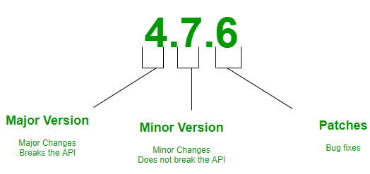

# Versioning

Vậy khi update từng phần thì cần cập nhật những gì?
## Major version update
- Force update
- Notify to user

## Minor version
- Notify to user about minor version

## Patch update
- No need to notify