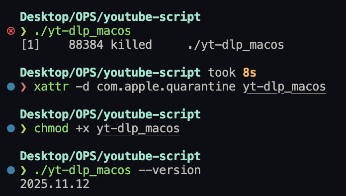

```bash
# Desktop/OPS/youtube-script took 8s 
❯ xattr -d com.apple.quarantine yt-dlp_macos

# Desktop/OPS/youtube-script 
❯ chmod +x yt-dlp_macos

# Desktop/OPS/youtube-script 
❯ ./yt-dlp_macos --version
2025.11.12
```

