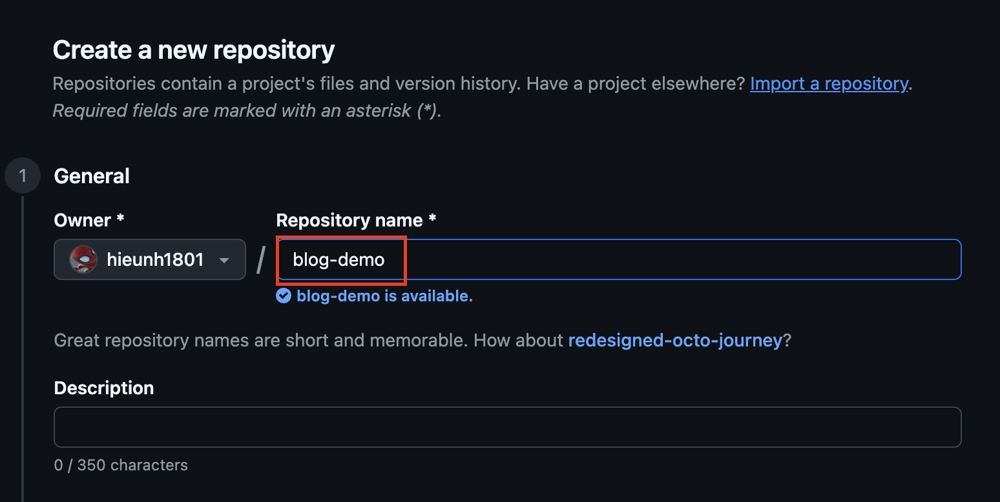
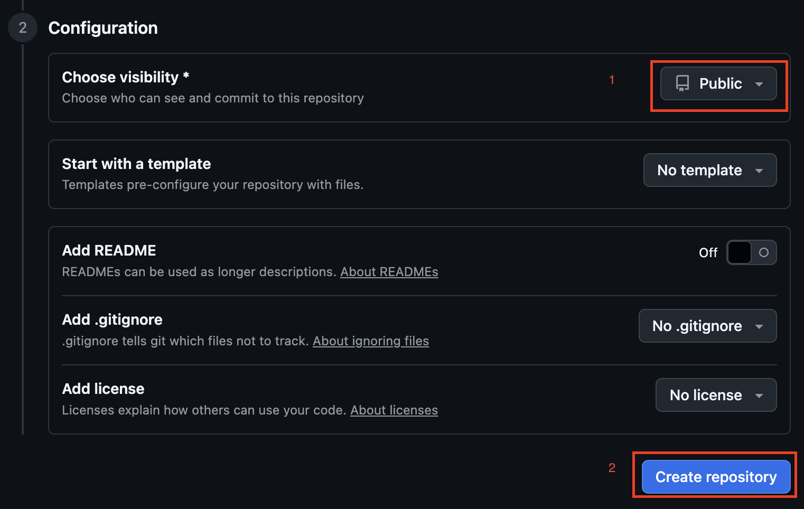
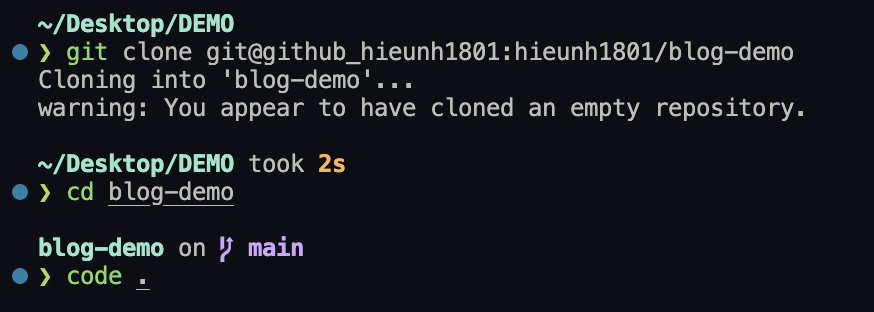
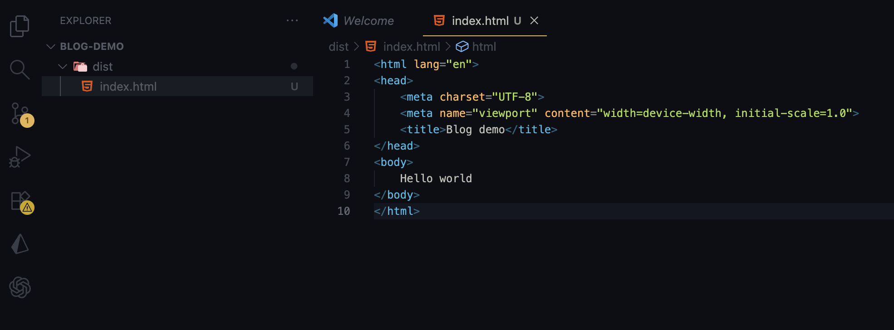
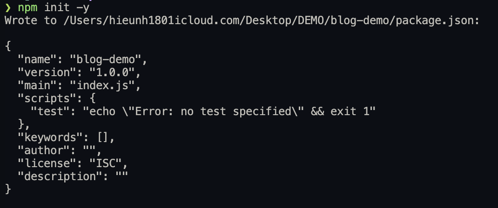
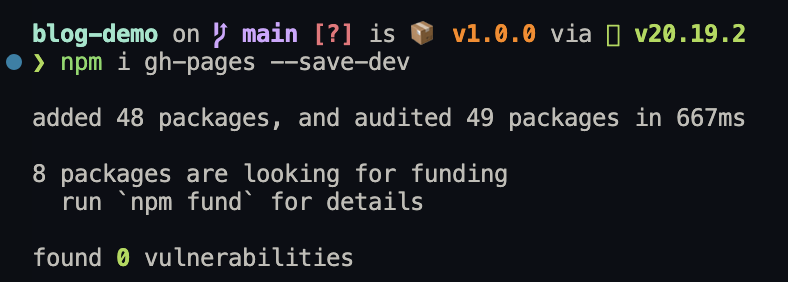
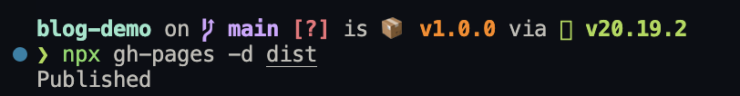
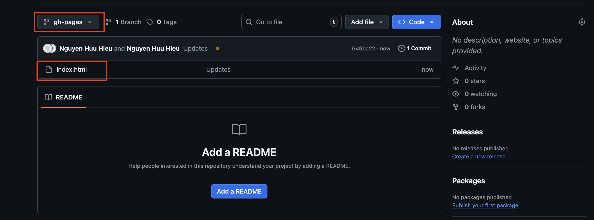
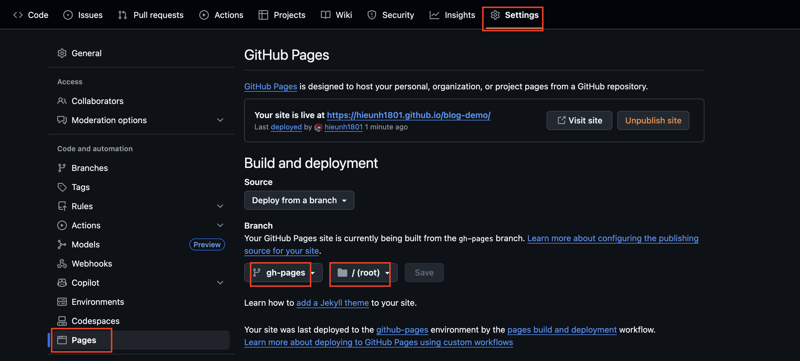

### Introduction

I want to deploy github page

### What You Need

- Environment: nodejs
- A file `index.html`

### Step-by-Step Guide

#### Step 1: Create new repository

    + Ensure that visibility is Publish => Otherwise you can't see `Pages`
#### Step 2: Clone to your local machine

#### Step 3: Add `index.html`

#### Step 4: Install gh-pages

#### Step 5: Using gh-pages to publish

#### Step 6: Turn your repo become pages

### Tips & Common Mistakes

#### Common 1: Cannot find resource (html, js, css, ...) in folder start with `_` like `_astro`
- Reason: gh-pages normaly use `jekyll` => It automaticlly ignore folder start with `_` for security issues.
- How to fix: 
    + Add `.nojekyll` to dist folder
    + Update command `gh-pages -d dist --dotfiles` to publish --dotfiles

### Conclusion

- Let me know more if you have any issues. Thanks.